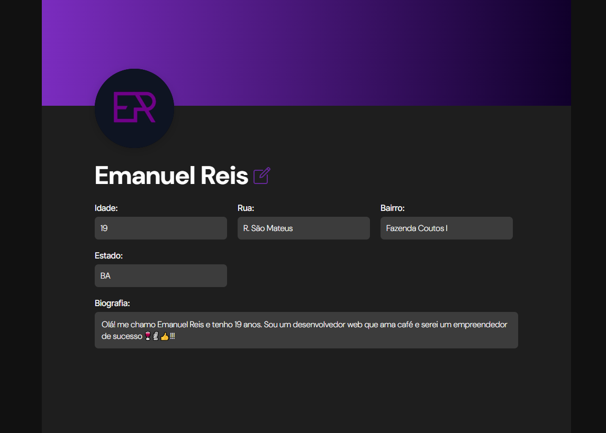
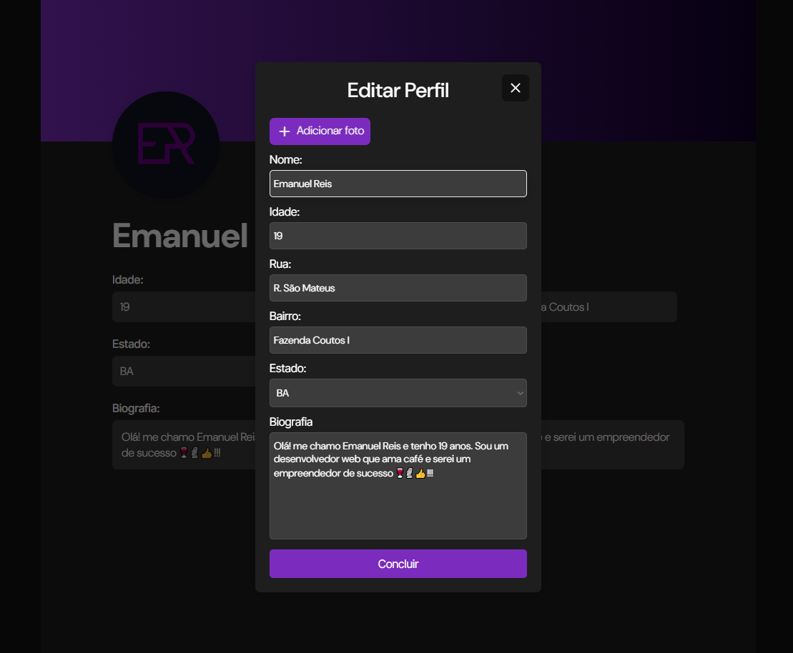

# Perfil do Usuário

### Descrição
  Criar a uma interface de perfil do usuário mostrando as suas informações. Nesta interface, o usuário poderar editar as suas informações como nome, foto e biografia. 
  Ao atualizar, as novas informações deverão ser salvas no banco de dados e, em seguida, amostradas na interface do perfil do usuário.  
### Tecnologias utilizadas:

#### Frontend

  
  
  

#### Backend

  
        

### Tela Inicial

 
Na tela inicial, é exibida todas as informações do usuário, como nome, foto de perfil, endereço e biografia. Ao lado do nome, temos um ícone para <strong>editar</strong>.

### Formulário de edição

 
Ao clicar no botão, o usuário tem acesso a um formulário com suas informações. Neste formulario, é possível alterar todas as suas informações inclusive sua foto de perfil.

### Como usar?
Para rodar o projeto, é necessário ter instalado o <strong>PHP 8+</strong> e banco de dados Mysql, também importante verificar se o driver PDO está habilitado nas configurações do seu PHP (se está utilizando XAMPP é provável que já esteja, mas a depender da versão é recomendado verificar). Para verificar, basta ir no diretório em que o PHP está instalado e procurar pelo arquivo <strong>php.ini</strong>.

Após localizar, encontre o trecho que está escrito <strong>;extension=pdo_mysql</strong> e apenas retire o ";". Depois disso, você já pode rodar o projeto.